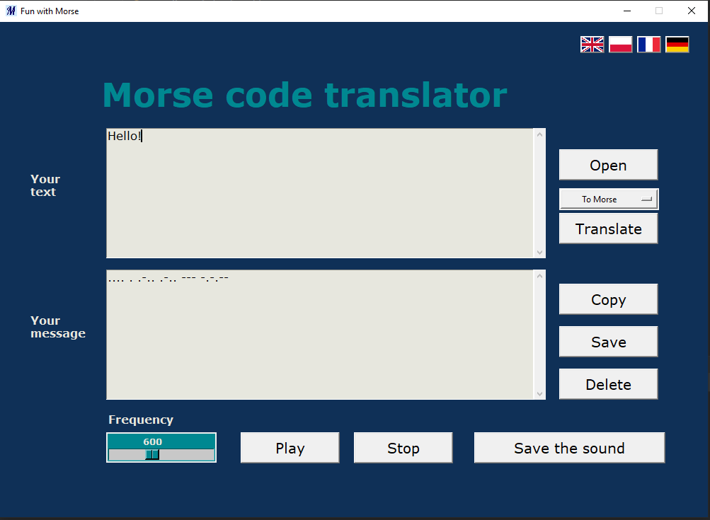

# Fun with Morse - GUI app
GUI app created with Python. It allows for a translation using Morse code and playing audio Morse code.

## Table of contents
* [General info](#general-info)
* [Screenshots](#screenshots)
* [Usage](#usage)
* [Setup](#setup)
* [Technologies](#technologies)

## General info

GUI supports 4 languages: English, Polish, French and German. The main feature of the application is the translation of 
text to Morse code in both directions. It can be used also to play the Morse code directly at chosen frequency and save 
it on your computer as WAV file. The message to translate can be written directly in the interface or uploaded from the 
computer. Subsequently the translation can be copied to clipboard or save as TXT file. The application reports errors as
 text messages.

## Screenshots
### Main Page


### Convert text to Morse code



### Convert Morse code to text


### Errors


## Setup
To run this project, install it locally:

```
$ git clone https://github.com/msbetsy/morse
```

## Usage
After you clone this repo to your desktop, go to its root directory, install requirements and run application.

```
$ cd morse
$ pip install -r requirements.txt
$ python main.py
```
## Technologies
Project is created with:
* Python version: 3.7
* NumPy library version: 1.20.1
* tkinter library version: 8.6
* Pillow library version: 8.1.0
* simpleaudio library version: 1.0.4
* wavio library version: 0.0.4
* pytest library version: 6.2.2
 
